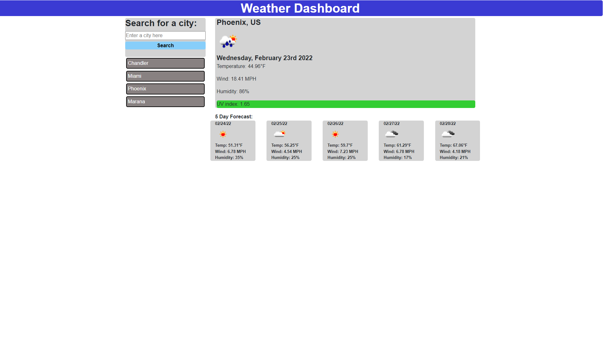

# Weather-dashboard
This is a weather-dashboard which uses the openweather api and does the following:
- Allows the user to search for a city's weather
- Displays user's searched city's:
    1. Current weather status by icon.
    2. Current date in city.
    3. Current temperature (in fahrenheit).
    4. Current wind (in MPH).
    5. Current Humidity percentage.
    6. Current uv index and uv index condition via scale (favorable = green, moderate = orange, and severe = red)
    7. 5 day forecast with respective additional icon, temperature, wind, and humidity values
- Lists all previously searched cities via hyerlink using local storage

 https://walidhkhan.github.io/weather-dashboard/